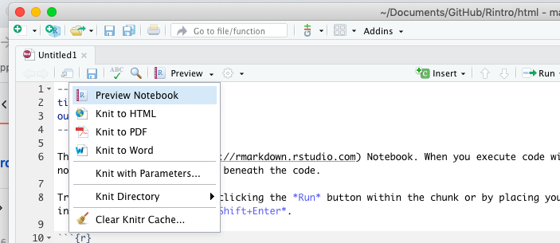

# Creating HTML in R

Some packages in R allow you to generate HTML webpages. These can then be published online.

The simplest way to generate HTML webpages is with an R Notebook. Here's how:

## Turning an R Notebook into a HTML webpage

First, in an R project create your R Notebook by going to **File > New File > R Notebook**. 

The notebook will be created with some template text: a 'metadata' section that starts and ends with `---`; some narrative in R Markdown; and a code block.

Look at the metadata section. It should have a `title` attribute and an `output` attribute:

```
---
title: "R Notebook"
output: html_notebook
---
```

By default the output is `html_notebook` which means you can create a HTML output of the notebook. If the output is something else then make sure you change it so it reads `output: html_notebook`.

From your notebook you can use the **Preview** menu (just above the first line of the notebook) to 'knit' the notebook to HTML or other formats. 

Click on **Preview > Knit to HTML** to start the process.

If you haven't already saved your notebook you will be asked to give the HTML file a name (the same name will be used for the .Rmd file). It will save it in the project folder by default.

If you have saved your notebook first it will create a HTML file with the same name.



Once the HTML file has been 'knitted' it will appear in a new window. You should also be able to see it in the project folder, and upload it to any website hosting you have.

The 'Preview' button will now change to a 'Knit' button. Whenever you want to update the HTML file to reflect the latest version of the notebook, click **Knit > Knit to HTML**.

## Generating a HTML version using R code

Rather than clicking on the 'Knit' button, you may need to automate the process by using R code. 

[The `rmarkdown` package](https://rmarkdown.rstudio.com/docs/) is a good place to start: this can be used to convert your R notebook into a HTML webpage, by using its `render()` function.

Here's an example of some code with uses the `render()` function from that package to create a HTML webpage from a specified R Markdown (.Rmd) file:

`rmarkdown::render("index.Rmd", output_format="all")`

There are two parameters being used here. The first is the name of the R Markdown file that you want to render into HTML. 

This file needs to be in the same folder as the project where you are writing the code (if it's not, you'll have to specify a path to it).

The second parameter specifies what format you want to render the notebook in. This is taken from the `output:` metadata in the notebook you've named. So if it says `output: html_document` then it will create a HTML document (regardless of extra elements like `df_print: paged`). 

*Note: If you try to render a notebook from within itself it will generate an error. Instead create two notebooks: one with the material you want to publish as a HTML page, and another which will 'render' the first notebook.*

You can find details on other options when using `render()` in [the documentation](https://rmarkdown.rstudio.com/docs/reference/render.html). It mentions another function - `knit()` which comes from [the `knitr` package](https://yihui.org/knitr/) which can also be used to generate documents from R notebooks. 

## Using the DT (datatables) package to generate interactive tables 

[The `DT` - datatables - package](https://rstudio.github.io/DT/) is a particularly useful package if you want your HTML page - or notebook - to include an interactive table.

First you will need to make sure `DT` is installed by running this line of code:

`install.packages("DT")`

And in a separate code block, activate `DT` in the library:

`library(DT)`

A default interactive table can be generated for any dataframe using code like this:

`DT::datatable(NAMEOFDF)`

Replace `NAMEOFDF` with the name of the dataframe you want to use for your table.

The default table will show the first 10 rows, with headings that include sort buttons, and a search box which will search all fields. 

But you can add extra parameters to customise your table further. 

[The documentation for the package](https://rstudio.github.io/DT/) provides lots of examples of the customisations that can be added. They include:

* Style, e.g. `style = 'bootstrap'`
* Caption, e.g. `caption = 'Something you need to know'`
* Adding filters to the top of each column: `filter = 'top'`
* The `options` parameter can be fed a list of further specifications, e.g. `options = list(pageLength = 30, autoWidth = TRUE)`

When put together the code might look like this:

```{r}
DT::datatable(analysisdf, 
              style = 'bootstrap', 
              caption = 'Analysis by the BBC England Data Unit', 
              filter = 'top', 
              options = list(pageLength = 30, autoWidth = TRUE)
              )
```

Note that the code has been split across lines and indented for easier reading, but this isn't essential.
